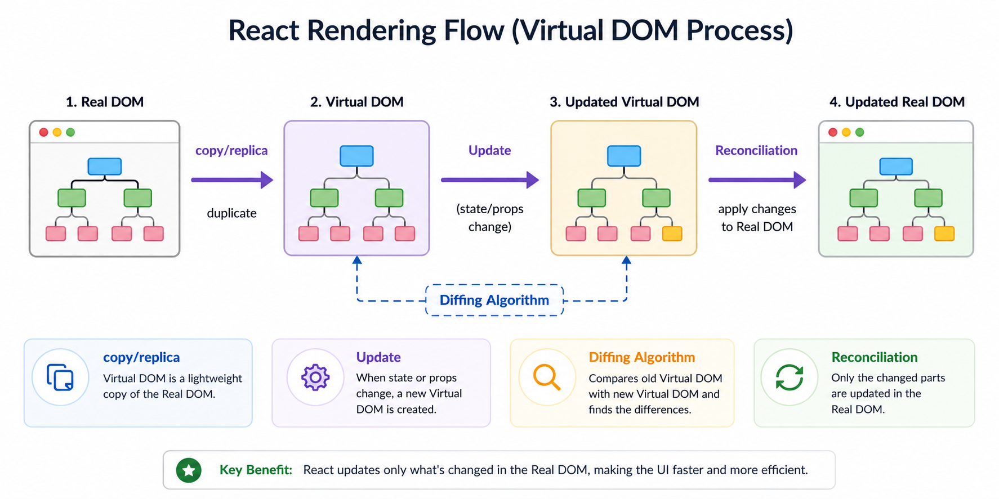

# 📘 React Introduction

## 1. Introduction

**React** is a JavaScript library developed by Meta Platforms for building user interfaces.

It helps developers create reusable UI components and build fast, scalable web applications.

👉 In simple terms:
React allows you to break UI into small reusable pieces called **components**.

---

## 2. Why React is Needed

Before React:

* Updating UI manually was complex
* Code became messy and hard to maintain
* Performance issues with frequent DOM updates

With React:

* Efficient UI updates using Virtual DOM
* Reusable components
* Clean and maintainable code

---

## 3. Key Features of React

### 🔹 Single Page Application (SPA)

* React apps use one HTML file (`index.html`)
* No full page reloads

### 🔹 Component-Based Architecture

* UI divided into reusable parts

### 🔹 Virtual DOM

Flow:

```
Real DOM → Virtual DOM → Updated Virtual DOM → Real DOM
```

```
          copy/replica                   Update                         Reconciliation
Real DOM -------------->  Virtual DOM -----------> Updated Virtual DOM --------------> Updated Real DOM
            duplicate                 Diffing Algorithm
```

---

### Small improvement (recommended version)

```markdown
```

Real DOM
│
├── copy/replica ──> Virtual DOM
│                        │
│                        ├── Update (state/props change)
│                        ↓
│                  Updated Virtual DOM
│                        │
│                        ├── Diffing Algorithm
│                        ↓
└────────────── Reconciliation ──────────────> Updated Real DOM

```
```
---



### 🔹 Diffing Algorithm

* Finds difference between old and new Virtual DOM

### 🔹 Reconciliation

* Updates only required parts in Real DOM

---

## 4. Library vs Framework

* **Library (React)** → You control the flow
* **Framework** → Framework controls your code

---

## 5. Project Structure Overview

### 🔹 index.html

* Single HTML file
* Contains root div

---

### 🔹 main.jsx

```js
import { StrictMode } from 'react'
import { createRoot } from 'react-dom/client'
import { BrowserRouter } from 'react-router-dom'
import App from './App.jsx'

createRoot(document.getElementById('root')).render(
  <BrowserRouter>
    <StrictMode>
      <App />
    </StrictMode>
  </BrowserRouter>
)
```

### 🔹 Key Points:

* `createRoot()` → creates React root
* `StrictMode` → detects issues (runs twice in dev)
* `BrowserRouter` → enables routing

---

### 🔹 App.jsx

```jsx
import Intro from './concepts/01. Introduction/Intro'
import { Add, Sub } from './concepts/01. Introduction/NamedModule'

function App() {
  const a = 7;
  const b = 3;

  return (
    <>
      <Intro />
      <h1>Addition of {a} + {b} = {Add(a,b)}</h1>
      <h1>Subtraction of {a} - {b} = {Sub(a,b)}</h1>
    </>
  )
}

export default App
```

---

## 6. Components

Components are reusable building blocks of UI.

### Types:

* Functional Components ✅
* Class Components ❌ (rarely used now)

---

## 7. Functional Component Example

```jsx
function Demo(){
  return <h2>Demo Component</h2>
}
```

---

## 8. JSX

* JavaScript + HTML-like syntax

```jsx
<h1>Hello World</h1>
```

---

## 9. Babel

* Converts JSX → JavaScript

---

## 10. Modules (Import & Export)

### Default Export

```jsx
export default function Demo(){}
```

```jsx
import Demo from './Demo'
```

---

### Named Export

```jsx
function Add(a,b){
  return a+b;
}

function Sub(a,b){
  return a-b;
}

export { Add, Sub }
```

```jsx
import { Add, Sub } from './NamedModule'
```

---

### Important Notes:

* Only one default export per file
* Multiple named exports allowed
* Names must match exactly

---

## 11. Practical Example

### Intro Component

```jsx
export default function Intro() {
  return <h1>Demo Component</h1>
}
```

---

### NamedModule.jsx

```jsx
function Add(a,b){
  return a+b;
}

function Sub(a,b){
  return a-b;
}

export { Add, Sub }
```

---

### Output

```
Addition of 7 + 3 = 10
Subtraction of 7 - 3 = 4
```

---

## 12. Real-World Use Case

React is used to build:

* Dashboards
* E-commerce apps
* Social media apps

---

## 13. Common Mistakes

* Forgetting export/import
* Mixing default and named imports
* Wrong file paths
* Not using fragments (`<> </>`)
* Misunderstanding Virtual DOM

---

## 14. Interview Questions (With Answers)

### 1. What is React?

React is a JavaScript library used to build user interfaces using reusable components.

---

### 2. Difference between Library and Framework?

* Library → You control flow (React)
* Framework → Framework controls flow

---

### 3. What is Virtual DOM?

Virtual DOM is a lightweight copy of the real DOM used by React to optimize updates.

---

### 4. What is JSX?

JSX is a syntax that allows writing HTML-like code inside JavaScript.

---

### 5. What is Diffing Algorithm?

It compares old Virtual DOM with new Virtual DOM and finds differences.

---

### 6. What is Reconciliation?

Process of updating real DOM based on changes found in Virtual DOM.

---

### 7. Difference between Named and Default Export?

| Feature     | Default Export | Named Export     |
| ----------- | -------------- | ---------------- |
| Count       | One per file   | Multiple allowed |
| Import name | Any name       | Must match       |
| Syntax      | import A from  | import {A}       |

---

### 8. Why StrictMode runs twice?

To detect side effects and bugs in development mode.

---

## 15. Practice Problems

1. Create a component displaying your name
2. Create add & multiply functions and export them
3. Import and use them in App.jsx
4. Create two components and render both
5. Break UI into multiple components

---

## 16. Summary

* React is a UI library
* Uses components
* Uses Virtual DOM
* Uses JSX
* Uses import/export modules

---
