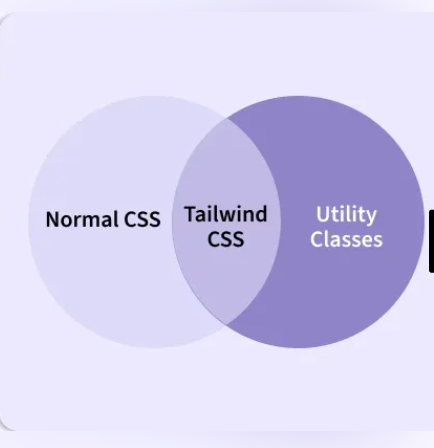
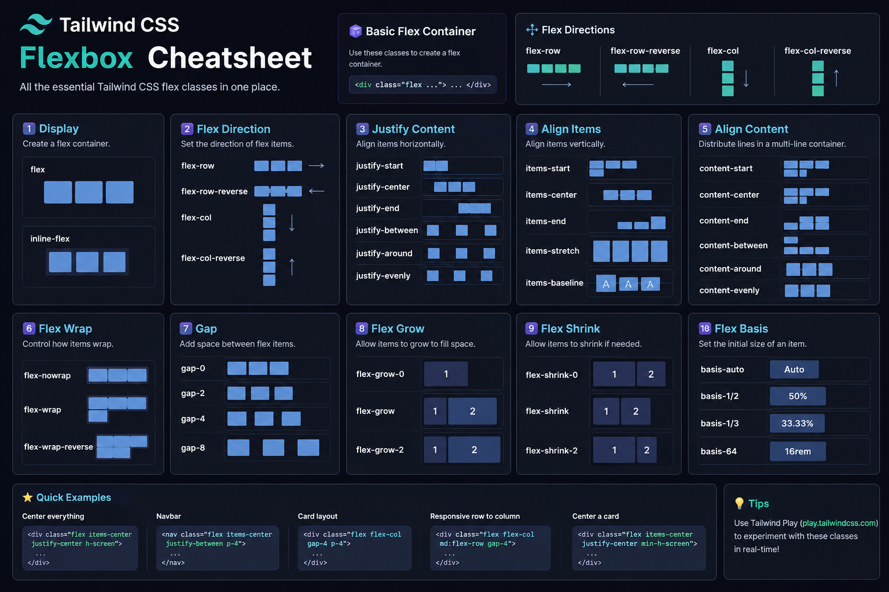
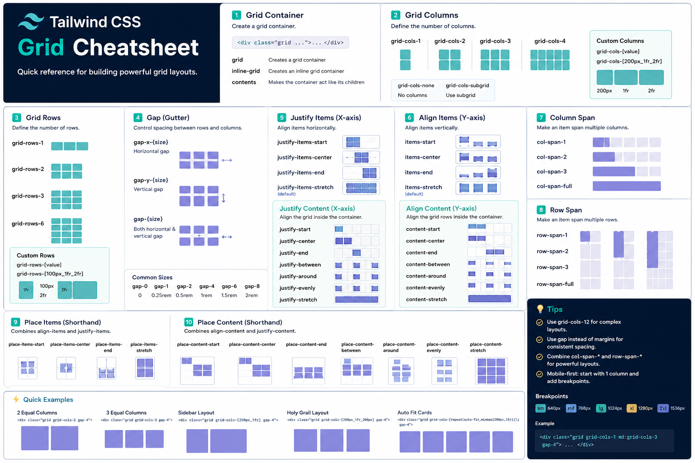

# Tailwind CSS with React + Vite

## 🎨 What is Tailwind CSS?

Tailwind CSS is a utility-first CSS framework that helps developers build modern and responsive UI quickly using predefined utility classes.

Instead of writing separate CSS files for every component, Tailwind allows developers to style directly inside JSX using utility classes.

Example:

```jsx
<button className="bg-blue-500 text-white px-4 py-2 rounded-lg">
  Click Me
</button>
```



---

## 📚 Official Documentation

* Tailwind CSS Official Documentation:
  [https://tailwindcss.com/](https://tailwindcss.com/)

* Tailwind CSS Installation Guide for Vite:
  [https://tailwindcss.com/docs/installation/using-vite](https://tailwindcss.com/docs/installation/using-vite)

* Vite Official Documentation:
  [https://vite.dev/](https://vite.dev/)

---

## ✅ Prerequisites

Before learning Tailwind CSS with React + Vite, make sure you know:

* HTML
* CSS
* JavaScript
* React Basics
* React Components
* React Styling Basics

Required Software:

* Node.js
* VSCode

Check Installation:

```bash
node -v
npm -v
```

---

## ⚡ Creating React Project using Vite

### Step 1: Create Vite Project

```bash
npm create vite@latest
```

### Step 2: Enter Project Folder

```bash
cd my-app
```

### Step 3: Install Dependencies

```bash
npm install
```

### Step 4: Run Project

```bash
npm run dev
```

---

## 📦 Installing Tailwind CSS

Install Tailwind CSS and Vite plugin:

```bash
npm install tailwindcss @tailwindcss/vite
```

---

## ⚙️ Configuring Vite

Open:

```bash
vite.config.js
```

Replace code with:

```js
import { defineConfig } from 'vite'
import react from '@vitejs/plugin-react'
import tailwindcss from '@tailwindcss/vite'

export default defineConfig({
  plugins: [
    react(),
    tailwindcss(),
  ],
})
```

---

## 🖌️ Adding Tailwind to CSS

Open:

```bash
src/index.css
```

Remove existing code and add:

```css
@import "tailwindcss";
```

---

## ▶️ Running the Project

```bash
npm run dev
```

---

## 🧪 Testing Tailwind CSS

Replace App.jsx code:

```jsx
function App() {
  return (
    <div className="h-screen flex items-center justify-center bg-black">
      <h1 className="text-5xl font-bold text-yellow-400">
        Tailwind CSS is Working 🚀
      </h1>
    </div>
  )
}

export default App
```

---

## 🧩 VSCode Extension

### Tailwind CSS IntelliSense

Recommended Extension:

* Tailwind CSS IntelliSense
* Publisher: Tailwind Labs

Features:

* Auto Suggestions
* Class Name Auto Completion
* Color Preview
* Hover Information
* Faster Development

---

## 🧠 Tailwind CSS Fundamentals

### Utility-First Approach

Tailwind provides utility classes for styling.

Example:

```jsx
<div className="bg-blue-500 text-white p-4 rounded-lg">
```

Instead of writing custom CSS, styling is directly applied using utility classes.

---

## 🛠️ Mostly Used Utility Classes

### 1. Spacing Utilities

Used for margin and padding.

#### Examples

```jsx
p-4
px-6
py-2
m-5
mt-10
```

| Class | Meaning            |
| ----- | ------------------ |
| p-4   | Padding all sides  |
| px-6  | Horizontal padding |
| py-2  | Vertical padding   |
| m-5   | Margin all sides   |
| mt-10 | Margin top         |

Example:

```jsx
<div className="p-4 m-5 bg-gray-200">
  Spacing Example
</div>
```

---

### 2. Color Utilities

Used for background, text, and border colors.

#### Examples

```jsx
bg-red-500
text-white
border-blue-500
```

Example:

```jsx
<button className="bg-blue-500 text-white px-4 py-2 rounded">
  Button
</button>
```

---

### 3. Typography Utilities

Used for fonts and text styling.

#### Examples

```jsx
text-xl
font-bold
italic
tracking-wide
```

Example:

```jsx
<h1 className="text-3xl font-bold italic">
  Typography Example
</h1>
```

---

### 4. Width & Height Utilities

Used for sizing.

#### Examples

```jsx
w-full
w-64
h-screen
min-h-screen
```

Example:

```jsx
<div className="w-64 h-40 bg-green-300">
  Box
</div>
```

---

### 5. Border & Radius Utilities

Used for borders and rounded corners.

#### Examples

```jsx
border
border-red-500
rounded
rounded-xl
```

Example:

```jsx
<div className="border border-black rounded-xl p-4">
  Border Example
</div>
```

---

### 6. Shadow Utilities

Used for box shadows.

#### Examples

```jsx
shadow
shadow-lg
shadow-xl
```

Example:

```jsx
<div className="shadow-lg p-4 rounded bg-white">
  Shadow Example
</div>
```

---

## ↔️ Flexbox in Tailwind CSS

Flexbox is used for alignment and layout building.

### Common Flex Classes

```jsx
flex
justify-center
items-center
flex-col
gap-4
```

---

### Flexbox Cheatsheet



---

### Flexbox Example

```jsx
<div className="flex justify-center items-center h-screen bg-gray-100">
  <div className="bg-blue-500 text-white p-6 rounded">
    Centered Box
  </div>
</div>
```

---

## 🔲 Grid System in Tailwind CSS

Grid is useful for creating layouts and card structures.

### Common Grid Classes

```jsx
grid
grid-cols-3
gap-5
```

---

### Grid Cheatsheet



---

### Grid Example

```jsx
<div className="grid grid-cols-3 gap-4">
  <div className="bg-red-300 p-4">1</div>
  <div className="bg-blue-300 p-4">2</div>
  <div className="bg-green-300 p-4">3</div>
</div>
```

---

## 📱 Responsive Design

Tailwind CSS follows mobile-first responsive design.

### Breakpoints

| Prefix | Screen Size    |
| ------ | -------------- |
| sm:    | Small Devices  |
| md:    | Medium Devices |
| lg:    | Large Devices  |
| xl:    | Extra Large    |
| 2xl:   | 2X Large       |

---

### Responsive Example

```jsx
<h1 className="text-sm md:text-xl lg:text-4xl">
  Responsive Text
</h1>
```

Meaning:

* Small screens → small text
* Medium screens → medium text
* Large screens → large text

---

## ✨ Pseudo Classes & States

Tailwind supports pseudo classes using prefixes.

### Hover State

```jsx
<button className="bg-blue-500 hover:bg-blue-700 text-white px-4 py-2 rounded">
  Hover Me
</button>
```

---

### Focus State

```jsx
<input className="border focus:outline-none focus:ring-2 focus:ring-blue-500" />
```

---

### Active State

```jsx
<button className="active:scale-95">
  Click
</button>
```

---

### Disabled State

```jsx
<button className="disabled:opacity-50">
  Disabled Button
</button>
```

---

## ⚛️ Tailwind with React Components

Tailwind works perfectly with reusable React components.

### Example

```jsx
function Button() {
  return (
    <button className="bg-black text-white px-4 py-2 rounded-lg">
      Button
    </button>
  )
}

export default Button
```

Usage:

```jsx
<Button />
```

---

## 🔀 Conditional Styling in React

Conditional styling is commonly used in React applications.

### Example

```jsx
function App() {
  const isActive = true

  return (
    <button
      className={isActive ? 'bg-green-500' : 'bg-red-500'}
    >
      Status
    </button>
  )
}
```

---

## 🌙 Dark Mode

Tailwind provides built-in dark mode support.

### Example

```jsx
<div className="bg-white dark:bg-black text-black dark:text-white p-4">
  Dark Mode Example
</div>
```

---

## Examples

### 1. Button Example

```jsx
<button className="bg-blue-500 hover:bg-blue-700 text-white px-5 py-2 rounded-lg">
  Click Me
</button>
```

---

### 2. Card Example

```jsx
<div className="bg-white shadow-lg rounded-xl p-6 w-80">
  <h1 className="text-2xl font-bold mb-2">
    Card Title
  </h1>

  <p className="text-gray-600 mb-4">
    Card Description
  </p>

  <button className="bg-black text-white px-4 py-2 rounded">
    Read More
  </button>
</div>
```

---

### 3. Form Example

```jsx
<form className="flex flex-col gap-4 w-80">
  <input
    type="text"
    placeholder="Username"
    className="border p-3 rounded"
  />

  <input
    type="password"
    placeholder="Password"
    className="border p-3 rounded"
  />

  <button className="bg-blue-500 text-white py-2 rounded">
    Login
  </button>
</form>
```

---

## 📁 Recommended Folder Structure

* As the project grows

```text
src/
│
├── components/
│   ├── Navbar.jsx
│   ├── Button.jsx
│   ├── Card.jsx
│
├── pages/
│   ├── Home.jsx
│   ├── About.jsx
│
├── layouts/
│   ├── MainLayout.jsx
│
├── App.jsx
├── main.jsx
├── index.css
```

---

## 🚀 Advantages of Tailwind CSS

* Faster UI Development
* Utility-First Approach
* Highly Customizable
* Responsive Design Made Easy
* No Need for Large CSS Files
* Excellent React Integration
* Modern Design Workflow
* Smaller Final CSS Bundle

---

## ⚠️ Disadvantages of Tailwind CSS

* Long Class Names
* JSX Can Become Messy
* Learning Curve for Beginners
* Repeated Utility Classes
* Harder to Read for Some Developers Initially

---

## ❌ Common Mistakes in Tailwind CSS

### 1. Adding Too Many Classes

Bad Example:

```jsx
<div className="bg-red-500 text-white p-4 rounded flex justify-center items-center w-full h-screen border shadow-lg">
```

Solution:

* Break UI into reusable components
* Keep code readable

---

### 2. Ignoring Responsive Design

Bad Practice:

```jsx
text-5xl
```

Better Practice:

```jsx
text-xl md:text-3xl lg:text-5xl
```

---

### 3. Not Using Reusable Components

Avoid repeating the same utility classes everywhere.

Create reusable React components.

---

### 4. Mixing Large CSS Files with Tailwind Unnecessarily

Tailwind is designed to reduce traditional CSS usage.

---

### 5. Forgetting Mobile-First Design

Always design for mobile screens first.

---

## 🏆 Best Practices

* Use reusable components
* Keep class names readable
* Practice responsive design
* Use Flexbox and Grid effectively
* Avoid unnecessary custom CSS
* Use Tailwind IntelliSense Extension
* Organize components properly

---

## Tailwind CSS vs Bootstrap

| Bootstrap                  | Tailwind CSS       |
| -------------------------- | ------------------ |
| Component-Based            | Utility-First      |
| Prebuilt UI                | Build Custom UI    |
| Opinionated Styling        | Highly Flexible    |
| More Ready-Made Components | More Customization |
| Larger CSS Bundle          | Smaller Final CSS  |

---

## Real-World Practice Projects

To master Tailwind CSS, practice building:

1. Responsive Navbar
2. Login Form
3. Portfolio Website
4. Dashboard UI
5. Product Cards
6. Pricing Section
7. Admin Panel
8. Sidebar Navigation
9. E-Commerce Layout
10. Blog UI

---

## 🎯 Important Tailwind Concepts to Master

* Utility Classes
* Flexbox
* Grid System
* Responsive Design
* Component-Based Styling
* Conditional Styling
* Dark Mode
* Hover & Focus States
* Layout Building

---

## 📌 Final Summary

Tailwind CSS is one of the most popular modern CSS frameworks for building fast, responsive, and scalable user interfaces.

When combined with React + Vite:

* React handles UI Components
* Tailwind handles Styling
* Vite handles Fast Development and Build Process

This combination is widely used in modern frontend development.

---

## 🔗 Useful Resources

### Tailwind CSS

[https://tailwindcss.com/](https://tailwindcss.com/)

### Tailwind Components

[https://tailwindui.com/](https://tailwindui.com/)

### DaisyUI

[https://daisyui.com/](https://daisyui.com/)

### Flowbite

[https://flowbite.com/](https://flowbite.com/)

### Heroicons

[https://heroicons.com/](https://heroicons.com/)

---

## ✍️ Author Notes

This README is prepared for:

* Interview Preparation
* Teaching Students
* Quick Revision Reference
* Public GitHub Reference Repository

Happy Learning 🚀